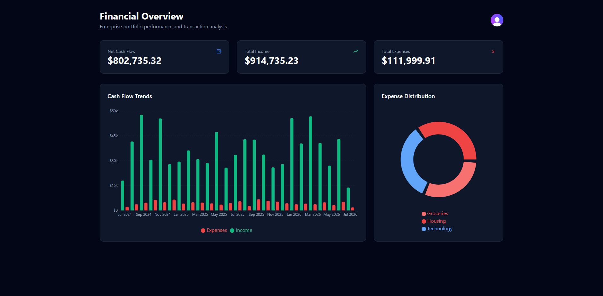

# ⚡️ Financial Analytics Dashboard


<div align="center">
  
</div>
<br />

A high-performance, full-stack financial tracking monorepo. It features a stunning Tailwind-powered React dashboard that visualizes cash flow and expense distributions using Recharts. Under the hood, it is driven by a bulletproof NestJS micro-architecture featuring Sentry telemetry, automated JIT database provisioning, and serverless Redis caching for lightning-fast API responses.

## 🚀 Live Deployments

- 📱 **Frontend (Vercel):** [https://financial-tracker-hfrm5hg81-andres-projects16.vercel.app/](https://financial-tracker-hfrm5hg81-andres-projects16.vercel.app/)
- ⚙️ **Backend API (Render):** [https://financial-tracker-api-mf8f.onrender.com](https://financial-tracker-api-mf8f.onrender.com)
- 🗄️ **Database (Neon Serverless):** PostgreSQL hosting.

### 🔑 Live Demo Access
To test the application without creating an account, simply visit the frontend link and click the **"Continue as Guest (Demo)"** button for instant access to the public analytics engine. 

Alternatively, to test the secure, authenticated database routing, log in with the following test credentials:
- **Email:** `test+clerk_test@example.com`
- **Password:** `Password123!`

---

## ✨ Features & Architecture Breakdown

This application is built as a strict Monorepo, dividing logic into three core enterprise pillars: The Frontend Visualization, The Backend Engine, and DevOps Infrastructure. 

### 📊 The Frontend Experience (React + Vite)
* **Interactive Data Visualization:** Utilizes `recharts` to render responsive, interactive tooltips, bar charts for cash flow trends, and strictly-typed pie charts for expense distribution. 
* **Graceful Degradation:** The UI implements strict API loading states and fallback error screens. If the backend goes offline, the UI handles it gracefully rather than crashing the browser with unhandled promise rejections.
* **Guest & Auth Segmentation:** Leverages `Clerk IAM` for bank-grade user management. Users can securely log in via OAuth/JWT, or instantly bypass auth into a sandboxed "Demo Mode" to view the capabilities of the platform frictionlessly.

### ⚙️ The Backend Engine (NestJS)
* **JIT Provisioning (Just-In-Time):** Automatically detects new authenticated users and seamlessly provisions isolated, user-specific mock data streams into the PostgreSQL database without manual intervention.
* **Serverless Caching:** Integrates `Upstash Redis` to cache heavy analytical database queries. This drops standard DB calculation times down to ~2 millisecond API responses.
* **Black-Box Telemetry:** Integrated `Sentry.io` flight recorder. Every unhandled exception in production is caught, analyzed, and alerted to the developer in real-time, completely preventing silent backend failures.

### 🛡️ Infrastructure & DevOps
* **GitHub Actions CI/CD:** A fully automated continuous integration pipeline. Every Pull Request and push to `main` spins up an Ubuntu server that installs dependencies and runs TypeScript compilation checks, physically blocking broken code from reaching production.
* **NPM Workspaces:** Clean monorepo structure separating `apps/web` and `apps/api` allowing for single-command dependency management and synchronized Gitflow.

---

## ⚙️ Tech Stack & Dependencies

### Runtimes
- **Node.js:** `v24.14.0`
- **npm:** `v11.16.0`

### Frontend (apps/web)
- **Framework:** React (`v19.2.7`), Vite (`v8.1.4`)
- **Styling:** Tailwind CSS, Lucide React (Icons)
- **State/Data Fetching:** TanStack React Query (`v5`)
- **Visuals:** Recharts

### Backend (apps/api) & Database
- **Framework:** NestJS (`v11.1.28`)
- **Security:** Clerk (JWT validation)
- **Database:** PostgreSQL (Neon)
- **Cache:** Upstash Redis
- **Monitoring:** Sentry

## 🚀 How to Run Locally

### 1. Clone the repository
```bash
git clone [https://github.com/notrexxx/financial-tracker.git](https://github.com/notrexxx/financial-tracker.git)
cd financial-tracker
```

### 2. Install Monorepo Dependencies
```bash
# This single command installs packages for both the API and the Web app
npm install
```

### 3. Start the NestJS Backend
```bash
# Ensure your apps/api/.env contains your Neon DB, Upstash Redis, Clerk, and Sentry keys
npm run start:dev --workspace=apps/api
```

### 4. Start the React Frontend
Open a second terminal window:
```bash
# Ensure your apps/web/.env contains your Vite Clerk keys and API URL
npm run dev --workspace=apps/web
```
Navigate to `http://localhost:5173` in your browser.

---

## Author

👤 **Andres Leon**

- GitHub: [@notrexxx](https://github.com/notrexxx)
- LinkedIn: [Emigdio Leon](https://linkedin.com/emigdio-leon-689109195)